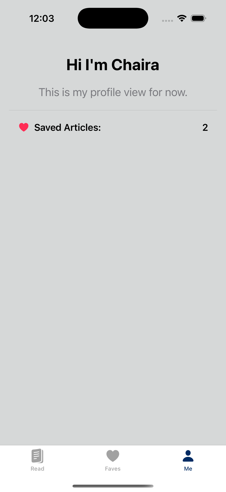

# Chai's Bias: A Mini News App

This is a lightweight iOS app built in SwiftUI that displays top news headlines from the [NewsAPI.org](https://newsapi.org/). Users can save (and unsave) their favourite articles and view their profile.

---

## Features

- **Top Headlines Feed**
  - Browse the latest U.S. news using [NewsAPI.org](https://newsapi.org/)
  - Double-tap an article to save it to your favorites

- **Favorites**
  - Press and hold to remove saved articles
  - All favorites persist across sessions (in-memory, can be extended to Core Data)

- **Profile**
  - View your saved article count
  - Will be adding more personalized features to the Profile view shortly.

- **Other Custom Design Elements**
  - Clean card-based layout with smooth styling
  - Custom tab bar color and subtle heart animations

---

## Screenshots - Video Demo on [chairaharder.com](https://chairaharder.com)

  

---

## Setup

1. Clone this repo
2. Open `ChaisBias.xcodeproj` in Xcode
3. Replace `"YOUR_API_KEY"` in `NewsAPIService.swift` with your [NewsAPI.org](https://newsapi.org/) key
4. Run on simulator or device running iOS 15+

---

## By

**Chaira Harder**  
[Portfolio](https://chairaharder.com) • [GitHub](https://github.com/cyberchai) • [LinkedIn](https://linkedin.com/in/chairaharder)
